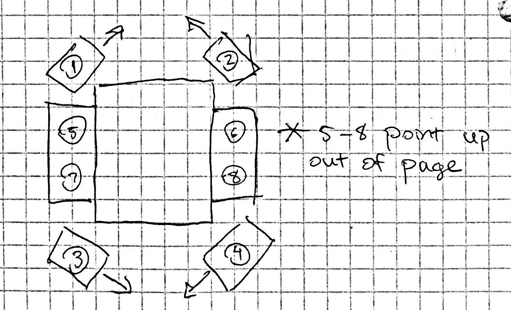

# 2020-MATE-ROV
Codebase for the GW Robotics MATE ROV

## Motor Controls Numbering Scheme

This is how the motors are numbered in the code.

## Color Coordination on Motor Wires
Motor number followed by its color
1. Brown
2. Orange
3. Yellow
4. Green
5. Blue
6. Violet
7. Gray
8. White
